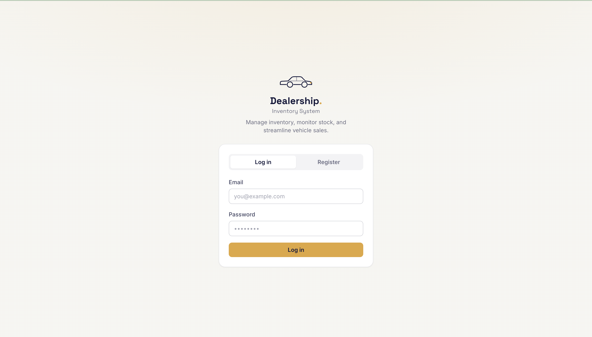
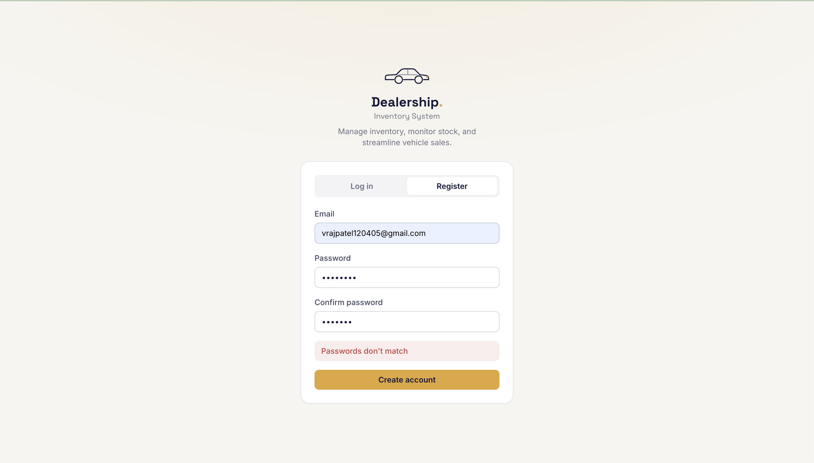
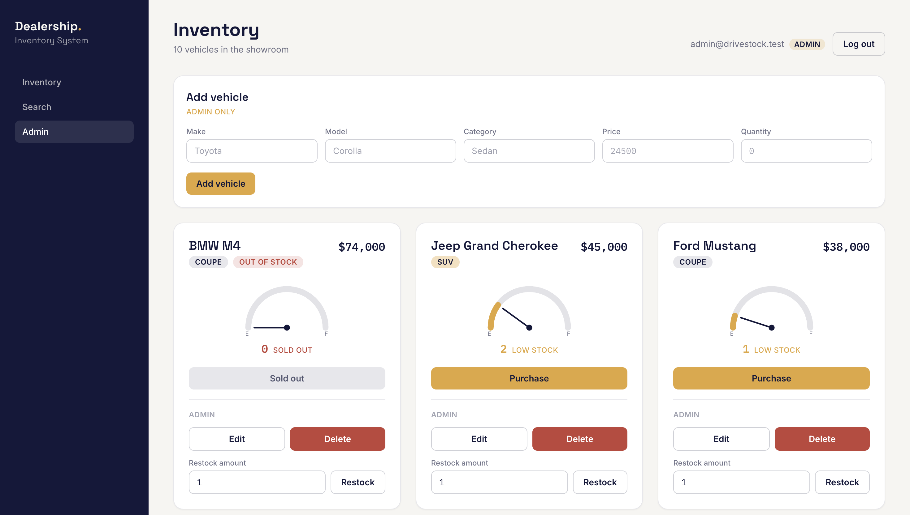
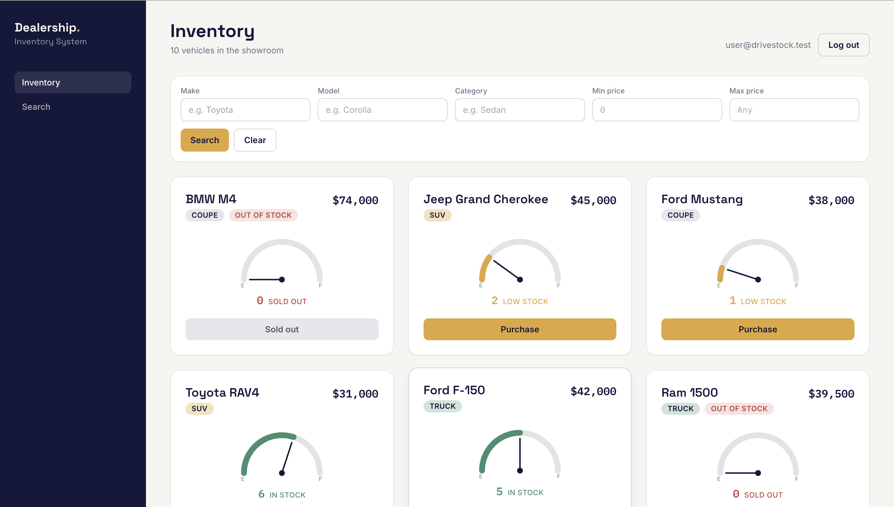
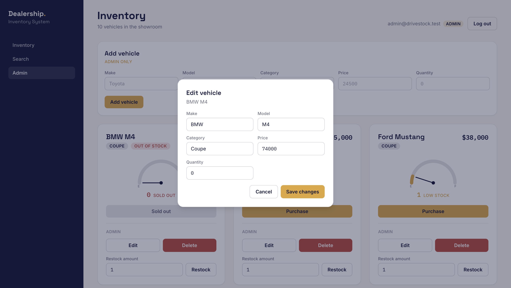

# Car Dealership Inventory System

A full-stack inventory management system for a car dealership, built as a
Test-Driven Development (TDD) kata for a job assessment. Admins can manage a
vehicle catalog; users can browse, search, and purchase vehicles. Inventory
quantity is the heart of the system, so stock levels are surfaced visually with
a signature fuel-gauge-style **StockGauge**.

> **Status:** complete. Auth and the full vehicle catalog (list, search, create,
> update, delete, purchase, restock) were built test-first (Red → Green →
> Refactor) and are covered by 42 passing backend tests. The React frontend
> covers login/register, browsing, search, purchase, and an admin management
> panel.

## Tech stack

**Backend**
- Node.js + TypeScript
- Express (REST API)
- SQLite via Prisma ORM (file-based database, not in-memory)
- JWT authentication (`jsonwebtoken`) + `bcryptjs` password hashing
- Jest + Supertest for tests

**Frontend**
- React + TypeScript
- Vite (dev server + build)
- Tailwind CSS (custom design tokens)

## Folder structure

```
car-dealership-inventory/
├── .gitignore
├── DESIGN.md              # Design system: colors, fonts, layout
├── PROMPTS.md             # Chronological log of AI prompts used
├── README.md
├── screenshots/           # UI screenshots referenced below
├── backend/
│   ├── .env.example
│   ├── .env.test          # Test-only env (points Jest at a separate test.db)
│   ├── package.json
│   ├── tsconfig.json
│   ├── jest.config.js     # + jest.setup.js / jest.global-setup.js
│   ├── prisma/            # schema.prisma, seed.ts, migrations/
│   ├── scripts/           # clean-dev-db.js
│   ├── src/
│   │   ├── app.ts             # Express app (exported for tests)
│   │   ├── server.ts          # Boots the HTTP server
│   │   ├── routes/            # auth.routes.ts, vehicle.routes.ts
│   │   ├── controllers/       # auth.controller.ts, vehicle.controller.ts
│   │   ├── services/          # auth.service.ts, vehicle.service.ts
│   │   ├── middleware/        # auth.middleware.ts (authenticate, requireAdmin)
│   │   └── utils/             # jwt.ts, prisma.ts, httpError.ts
│   └── tests/                 # auth.test.ts, vehicle.test.ts, helpers/auth.ts
└── frontend/
    ├── package.json
    ├── vite.config.ts
    ├── tsconfig.json
    ├── tailwind.config.ts
    ├── postcss.config.js
    ├── index.html
    └── src/
        ├── main.tsx
        ├── App.tsx
        ├── index.css
        ├── types.ts
        ├── context/           # AuthContext.tsx
        ├── lib/               # api.ts (typed fetch wrapper)
        └── components/         # Button, Badge, StockGauge, VehicleCard,
                                #   AuthPanel, SearchBar, AddVehicleForm,
                                #   EditVehicleModal, formStyles.ts
```

## API overview

| Method | Path                          | Auth        | Notes                                   |
| ------ | ----------------------------- | ----------- | --------------------------------------- |
| POST   | `/api/auth/register`          | public      | Returns token + user (no passwordHash)  |
| POST   | `/api/auth/login`             | public      | Returns token + user                    |
| POST   | `/api/vehicles`               | user        | Create a vehicle                        |
| GET    | `/api/vehicles`               | user        | List all vehicles                       |
| GET    | `/api/vehicles/search`        | user        | Filter by make/model/category/price     |
| PUT    | `/api/vehicles/:id`           | user        | Update a vehicle                        |
| DELETE | `/api/vehicles/:id`           | **admin**   | Delete a vehicle                        |
| POST   | `/api/vehicles/:id/purchase`  | user        | Atomic quantity decrement               |
| POST   | `/api/vehicles/:id/restock`   | **admin**   | Atomic quantity increment               |

## Local setup

### Backend

```bash
cd backend
npm install
cp .env.example .env

# Generate a strong JWT secret and paste it into .env as JWT_SECRET
node -e "console.log(require('crypto').randomBytes(32).toString('hex'))"

npx prisma generate
npx prisma migrate dev --name init
npx prisma db seed   # seeds test accounts + sample vehicles (idempotent)

npm test          # runs Jest + Supertest
npm run dev       # starts the API on http://localhost:4000
```

The seed (`backend/prisma/seed.ts`) is idempotent — re-running it updates the
same rows rather than creating duplicates — so it's safe to run any time you want
to reset the local data to a known, review-ready state.

Environment variables (see `.env.example`):

| Variable         | Example              | Purpose                        |
| ---------------- | -------------------- | ------------------------------ |
| `DATABASE_URL`   | `file:./dev.db`      | SQLite database file path      |
| `JWT_SECRET`     | (generated hex)      | Signs/verifies JWTs            |
| `JWT_EXPIRES_IN` | `1d`                 | Token lifetime                 |
| `PORT`           | `4000`               | API port                       |

#### Test accounts

After running `npx prisma db seed`, two accounts are available for local review:

| Role  | Email                   | Password    |
| ----- | ----------------------- | ----------- |
| Admin | `admin@drivestock.test` | `Admin123!` |
| User  | `user@drivestock.test`  | `User123!`  |

> These are **seed data for local review only** — not real credentials. The
> passwords are hashed with bcryptjs (same helper as `registerUser`) before being
> stored. Never reuse them anywhere real.

The admin account can add / edit / delete / restock vehicles immediately; the
user account is a normal browse-and-purchase login. The seed also loads 8 sample
vehicles across Sedan / Truck / SUV / Coupe with varied stock, including two at
quantity 0 so the "Sold out" state is visible right away.

#### Promoting a user to ADMIN (local testing)

The public `POST /api/auth/register` endpoint only ever creates `USER`-role
accounts — there is intentionally **no UI or API to self-promote to ADMIN**, as
that would be a security hole. To test admin-only features (add / edit / delete /
restock) locally, register a normal user through the app, then flip that user's
role directly in the database:

**Option A — Prisma Studio (GUI):**

```bash
cd backend
npx prisma studio          # opens http://localhost:5555
# Open the `User` table → find your user → set `role` to ADMIN → Save.
```

**Option B — one-line SQL (sqlite3):**

```bash
# from the backend/ directory
sqlite3 prisma/dev.db "UPDATE User SET role='ADMIN' WHERE email='you@example.com';"
```

The role is read from the database at login time and encoded into the JWT, so
**log out and log back in** after promoting for the new role to take effect.

### Frontend

```bash
cd frontend
npm install
npm run dev       # Vite dev server (default http://localhost:5173)
npm run build     # production build into dist/
```

## Screenshots











## Test report

Backend test suite (`cd backend && npm run test:coverage`):

```
PASS tests/auth.test.ts
PASS tests/vehicle.test.ts
------------------------|---------|----------|---------|---------|----------------------------
File                    | % Stmts | % Branch | % Funcs | % Lines | Uncovered Line #s
------------------------|---------|----------|---------|---------|----------------------------
All files               |   89.78 |    74.72 |   94.59 |   90.84 |
 src                    |   88.23 |      100 |   33.33 |   88.23 |
  app.ts                |   88.23 |      100 |   33.33 |   88.23 | 15,23
 src/controllers        |      96 |    68.18 |     100 |   95.89 |
  auth.controller.ts    |     100 |       50 |     100 |     100 | 7-17
  vehicle.controller.ts |   95.08 |    72.22 |     100 |   94.91 | 32,42,110
 src/middleware         |    82.6 |    66.66 |     100 |    82.6 |
  auth.middleware.ts    |    82.6 |    66.66 |     100 |    82.6 | 32-33,50-51
 src/routes             |     100 |      100 |     100 |     100 |
  auth.routes.ts        |     100 |      100 |     100 |     100 |
  vehicle.routes.ts     |     100 |      100 |     100 |     100 |
 src/services           |   87.28 |    80.76 |     100 |    89.9 |
  auth.service.ts       |   97.14 |      100 |     100 |   97.14 | 86
  vehicle.service.ts    |   83.13 |     75.6 |     100 |   86.48 | 53,87-89,92-94,150,160,170
 src/utils              |   84.37 |    63.63 |     100 |   84.37 |
  httpError.ts          |      80 |      100 |     100 |      80 | 25-26
  jwt.ts                |   82.35 |    42.85 |     100 |   82.35 | 16,30,34
  prisma.ts             |     100 |      100 |     100 |     100 |
------------------------|---------|----------|---------|---------|----------------------------

Test Suites: 2 passed, 2 total
Tests:       42 passed, 42 total
Snapshots:   0 total
Time:        2.075 s
Ran all test suites.
```

## My AI Usage

**Tools used**

- **Cursor with Claude Opus 4.8** — used for all code generation and
  implementation across every phase (backend services, tests, frontend
  components, seed script, refactors).
- **A separate planning/troubleshooting conversation with Claude (Anthropic)**
  — used for phase-by-phase prompt design, code-review guidance, commit-message
  drafting, and process decisions (including recovering from a git tooling
  mistake mid-project).

**Concrete examples** (see `PROMPTS.md` for the full chronological log)

1. **TDD implementation (vehicle listing / creation / search).** Prompted for
   `vehicle.test.ts` covering create (201, and 400 on negative price/quantity),
   list, and combinable case-insensitive search — with the tests confirmed
   failing against the `501` stubs (Red) *before* implementing
   `listVehicles`/`createVehicle`/`searchVehicles`. Result: Red confirmed, then
   green, `tsc` clean.

2. **A review that caught a real gap (DB persistence of the quantity default).**
   A follow-up review noted the "quantity defaults to 0" test only asserted the
   HTTP response body, so I had it add an independent
   `prisma.vehicle.findUnique` re-fetch to actually prove persistence — and
   resolve that the schema's `@default(0)` was effectively dead code, keeping the
   TypeScript default (consistent with how `price` is validated) and annotating
   `@default(0)` as a defensive fallback.

3. **Closing test-coverage gaps.** Prompted to run coverage and then add the
   assessment's called-out edge cases — invalid/expired/missing JWT, non-admin
   `403`s, purchase/update on nonexistent ids, empty-string (not just missing)
   register fields, and login edge cases (wrong password / unknown email).
   Coverage improved across the board; no bugs were found, and `requireAdmin`'s
   unreachable `req.user`-unset branch was left intentionally uncovered.

4. **A process/judgment moment (git recovery).** A folder-flattening `mv`
   command misfired and left the original scaffold + auth commits unreachable.
   Rather than fabricating history, I used the planning conversation to work
   through a stray-repo cleanup and recover the work with a single honest restore
   commit — prioritizing an accurate, auditable history over a tidy-looking one.

**Reflection**

I used Cursor with Claude Opus 4.8 throughout this project to speed up
development while keeping responsibility for the final implementation myself. AI
helped generate project scaffolding, suggest implementations, write initial
tests, and assist with frontend components, but every generated change was
reviewed, integrated, and tested before becoming part of the project.

One of the biggest lessons from this project was that AI-generated code should be
treated like a pull request from another developer. Even when the code looked
correct, I found it important to review the logic, verify edge cases, and confirm
that the implementation matched the requirements. This process helped identify a
few issues that required refinement before the code was ready.

Working on this assessment also reinforced the value of a disciplined workflow.
Combining AI assistance with testing, code reviews, and frequent commits helped
me maintain confidence in the implementation while moving much faster than I
could have by writing everything manually.

If I were starting this project again, I would separate every TDD cycle into
individual Red, Green, and Refactor commits from the beginning. I adopted that
approach later in the project, and it made the development process much easier to
understand through the Git history.

Overall, this project showed me that AI is a powerful productivity tool, but
producing reliable software still depends on understanding the problem, reviewing
every change carefully, validating behavior through testing, and taking ownership
of the final solution.
